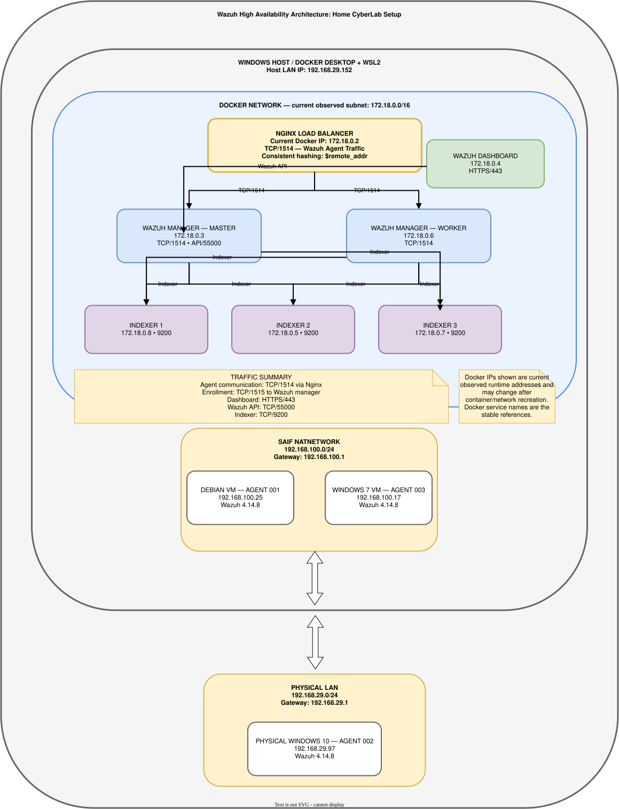

# Wazuh Docker HA Homelab

A cybersecurity homelab built around a highly available Wazuh deployment using Docker, Docker Compose, VirtualBox, and Debian-based endpoints.

---

## Project Overview

This project is designed as a practical cybersecurity learning environment for:

- Security monitoring and SIEM practice
- Wazuh manager clustering
- Wazuh indexer clustering
- Endpoint monitoring
- Log collection and analysis
- Docker and container administration
- Network monitoring and troubleshooting
- Git/GitLab project management
- Cybersecurity lab experimentation
- High-availability architecture
- Security event detection and investigation

The environment is intentionally designed to reduce the number of virtual machines required by running the Wazuh server infrastructure in Docker.

---

# Beginner's Guide: Understanding This Lab

This section explains the basic concepts used in this project for someone who may have little or no previous experience with networking, virtualization, Docker, SIEM, or Wazuh.

You do not need to understand everything before starting the lab. The purpose of this section is to explain what the different pieces are and how they fit together.

---

## 1. Basic Computer Concepts

### Host

A **host** is a physical or virtual computer that runs other software, services, virtual machines, or containers.

In this project, the main host is the physical Windows computer running:

- Windows
- Docker Desktop
- WSL2
- VirtualBox
- Git
- VS Code

The host provides the hardware resources such as:

- CPU
- RAM
- Storage
- Network connectivity

---

### Server

A **server** is a system that provides a service to other systems.

A server does not necessarily have to be a physical computer.

For example, in this project:

- Wazuh Manager acts as a security management server.
- Wazuh Indexer provides event storage and search.
- Wazuh Dashboard provides the web interface.
- Nginx provides load-balancing services.

These are implemented as Docker containers rather than separate physical computers.

---

### Endpoint

An **endpoint** is a computer or device that is being monitored or protected.

Examples include:

- Windows computers
- Linux computers
- Virtual machines
- Servers
- Workstations

In this lab the endpoints are:

| Endpoint | Wazuh Agent |
|---|---|
| Debian VM | Agent 001 |
| Physical Windows 10 | Agent 002 |
| Windows 7 VM | Agent 003 |

The Wazuh Agent runs on these systems and sends security-related information to the Wazuh infrastructure.

---

## 2. Networking Basics

### IP Address

An **IP address** identifies a device on an IP network.

For example:

```text
192.168.100.25
```

is the current IP address of the Debian Wazuh endpoint.

Another example:

```text
192.168.29.97
```

is the physical Windows 10 endpoint.

---

### IPv4 Address

The addresses used in this project are IPv4 addresses.

An IPv4 address contains four numbers separated by dots:

```text
192.168.100.25
```

Each number can range from:

```text
0 to 255
```

---

### Subnet

A **subnet** is a logical section of an IP network.

For example:

```text
192.168.100.0/24
```

represents a network containing addresses in the `192.168.100.x` range.

The `/24` indicates the network prefix length.

A common equivalent subnet mask is:

```text
255.255.255.0
```

---

### LAN

LAN means **Local Area Network**.

It is a network connecting devices within a local environment such as:

- Home
- Office
- Laboratory
- School

This project uses a physical LAN and a VirtualBox NAT Network.

---

### Gateway

A **gateway** is normally the device that provides a path from one network to another.

For example, the VirtualBox NAT Network in this lab uses:

```text
192.168.100.1
```

as its gateway.

---

### Port

A **port** identifies a particular network service on a system.

Think of an IP address as identifying the building and a port as identifying a particular door or service inside that building.

For example:

```text
192.168.29.152:1514
```

means:

- IP address: `192.168.29.152`
- Port: `1514`

Wazuh uses several ports for different purposes.

---

### TCP

TCP means **Transmission Control Protocol**.

TCP provides reliable, connection-oriented communication.

Wazuh agent communication in this lab primarily uses TCP.

For example:

```text
TCP/1514
```

is used for Wazuh agent event communication.

---

### UDP

UDP means **User Datagram Protocol**.

UDP is connectionless and has lower protocol overhead than TCP.

This lab can use:

```text
UDP/514
```

for syslog traffic when configured.

---

## 3. Virtual Machines

### What is a VM?

VM means **Virtual Machine**.

A virtual machine is a software-created computer that runs inside another computer.

The physical computer is called the **host**.

The virtual computer is called the **guest**.

For example:

```text
Physical Windows Computer
        |
        +-- VirtualBox
              |
              +-- Debian VM
              |
              +-- Windows 7 VM
```

Each VM behaves like a separate computer with its own:

- Operating system
- CPU allocation
- RAM allocation
- Virtual disk
- Network adapter
- IP address

---

### Why use VMs in this lab?

VMs allow us to safely create multiple systems for cybersecurity practice without requiring multiple physical computers.

For example:

```text
Windows Host
    |
    +-- Debian VM
    |
    +-- Windows 7 VM
```

The Debian and Windows 7 systems can act as cybersecurity endpoints.

---

## 4. VirtualBox

**Oracle VirtualBox** is virtualization software.

It allows us to create and run virtual machines.

In this project, VirtualBox is used mainly for endpoint systems such as:

- Debian
- Windows 7

The main Wazuh infrastructure does not need to run inside multiple VirtualBox VMs because it is implemented using Docker.

This reduces the number of VMs and therefore reduces resource consumption.

---

## 5. VirtualBox NAT Network

The lab uses a VirtualBox NAT Network called:

```text
Saif NatNetwork
```

The current network is:

```text
192.168.100.0/24
```

with gateway:

```text
192.168.100.1
```

Current endpoints include:

```text
Debian       192.168.100.25
Windows 7    192.168.100.17
```

A NAT Network allows the virtual machines to communicate through a common virtual network while also providing connectivity through the host's networking environment.

---

# 6. Docker Basics

## What is Docker?

**Docker** is a platform for running applications inside isolated environments called containers.

Instead of installing every application directly onto the operating system, Docker packages applications and their dependencies into containers.

In this project, Wazuh components run as Docker containers.

---

## Container

A **container** is an isolated runtime environment for an application.

For example, this project has containers for:

```text
Nginx
Wazuh Manager Master
Wazuh Manager Worker
Wazuh Indexer 1
Wazuh Indexer 2
Wazuh Indexer 3
Wazuh Dashboard
```

You can see them with:

```powershell
docker compose ps
```

---

## Docker Image

A **Docker image** is a packaged template used to create containers.

For example:

```text
learninforensicurity123/wazuh-manager:4.14.8
```

is an image reference.

A container is created from an image.

A simplified relationship is:

```text
Docker Image
     |
     v
Container
```

---

## Docker Compose

**Docker Compose** allows multiple containers to be defined and managed together.

Instead of starting seven containers individually, the project can use:

```powershell
docker compose up -d
```

to start the complete Wazuh stack.

Similarly:

```powershell
docker compose down
```

stops and removes the running containers defined by the Compose project.

---

## Docker Volume

A Docker volume is persistent storage associated with containers.

Volumes are important because container filesystems are not always intended to be the primary location for persistent application data.

This Wazuh deployment uses volumes for important data such as:

- Wazuh configuration
- Wazuh queues
- Indexer data
- Certificates
- Other persistent application data

**Do not delete Wazuh volumes casually.**

Removing volumes can permanently remove application state and data.

---

## Docker Hub

**Docker Hub** is a registry for Docker images.

This project publishes the Wazuh images used for the lab under:

```text
learninforensicurity123
```

The current repositories include:

```text
learninforensicurity123/wazuh-manager
learninforensicurity123/wazuh-indexer
learninforensicurity123/wazuh-dashboard
```

Docker Hub provides image distribution, while GitHub/GitLab provide source-code and project-documentation version control.

---

# 7. VM vs Container

VMs and containers are not the same thing.

### Virtual Machine

A VM generally contains:

```text
Virtual Hardware
       |
Guest Operating System
       |
Applications
```

### Container

A container generally shares the host operating system's kernel while isolating the application environment:

```text
Host Operating System
       |
Container Runtime
       |
Containers
       |
Applications
```

For this project:

```text
VirtualBox
   |
   +-- Debian
   +-- Windows 7

Docker
   |
   +-- Wazuh Manager
   +-- Wazuh Indexers
   +-- Wazuh Dashboard
   +-- Nginx
```

This combination gives the lab both realistic endpoints and a relatively resource-efficient Wazuh infrastructure.

---

# 8. Cybersecurity Basics

## Cybersecurity

Cybersecurity is the practice of protecting:

- Computers
- Networks
- Applications
- Accounts
- Data
- Services

against unauthorized access, misuse, disruption, modification, or destruction.

---

## Security Event

A **security event** is something that happens on a system that may be relevant to security.

Examples:

- A user logs in.
- A failed login occurs.
- A file changes.
- A new process starts.
- A service starts or stops.
- A firewall blocks traffic.
- A suspicious command is executed.

Not every security event is malicious.

---

## Log

A **log** is a record of activity produced by a system or application.

Examples:

```text
Windows Event Logs
Linux system logs
Authentication logs
Application logs
Firewall logs
```

Wazuh collects and analyzes many types of security-relevant information.

---

## Alert

An **alert** is generated when monitored activity matches a detection rule or otherwise meets a condition that Wazuh considers important.

For example:

```text
Failed authentication attempts
        |
        v
Wazuh detection rule
        |
        v
Alert
```

An alert does not automatically mean that an attack has occurred.

It means that activity requiring attention has been detected.

---

## Event vs Alert vs Incident

These terms are related but different.

### Event

Something happened.

Example:

```text
A user entered an incorrect password.
```

### Alert

The monitoring system detected something potentially important.

Example:

```text
Multiple authentication failures detected.
```

### Incident

A confirmed or investigated security situation requiring response.

Example:

```text
Investigation confirms unauthorized access.
```

A useful simplified model is:

```text
Event
  |
  v
Detection
  |
  v
Alert
  |
  v
Investigation
  |
  v
Incident / Benign Activity
```

---

## Vulnerability

A **vulnerability** is a weakness that could potentially be exploited.

Examples include:

- Unpatched software
- Weak configuration
- Insecure permissions
- Vulnerable services

---

## Exploit

An **exploit** is a technique, code, or action that takes advantage of a vulnerability.

For authorized cybersecurity labs, vulnerabilities and exploits can be studied in controlled environments.

---

## IOC

IOC means **Indicator of Compromise**.

An IOC is evidence that may indicate malicious activity.

Examples include:

- Suspicious IP address
- Malicious file hash
- Suspicious domain
- Known malware filename
- Unusual persistence mechanism

---

## MITRE ATT&CK

**MITRE ATT&CK** is a knowledge base describing adversary tactics and techniques.

It is commonly used by security teams to understand:

- How attackers operate
- What techniques they use
- How detections can be developed
- How security events can be mapped to attacker behavior

---

# 9. What is a SIEM?

SIEM stands for:

**Security Information and Event Management**

A SIEM collects and analyzes security-related information from multiple systems.

A simplified SIEM workflow is:

```text
Endpoints
   |
   v
Logs / Security Events
   |
   v
Collection
   |
   v
Analysis / Correlation
   |
   v
Alerts
   |
   v
Investigation
```

A SIEM helps security analysts understand what is happening across an environment.

Wazuh provides SIEM capabilities as part of its broader security platform.

---

# 10. What is Wazuh?

**Wazuh** is an open-source security platform that provides capabilities including security monitoring, threat detection, log analysis, file integrity monitoring, vulnerability detection, and SIEM/XDR-related functionality.

In this project, Wazuh is the central security monitoring platform.

The basic idea is:

```text
Endpoints
    |
    | Security telemetry
    v
Wazuh
    |
    +-- Detection
    +-- Analysis
    +-- Indexing
    +-- Visualization
    |
    v
Security Analyst
```

---

# 11. Wazuh Agent

The **Wazuh Agent** is installed on an endpoint.

Examples:

```text
Debian
Windows 7
Windows 10
```

The agent collects security-related information from the endpoint and communicates with the Wazuh manager.

Depending on configuration, the agent can monitor things such as:

- System logs
- Authentication activity
- Windows Event Logs
- File changes
- Running processes
- Configuration changes
- Security-related events

Current lab agents:

| Agent | Endpoint | IP |
|---|---|---|
| 001 | Debian | `192.168.100.25` |
| 002 | Windows 10 | `192.168.29.97` |
| 003 | Windows 7 | `192.168.100.17` |

---

# 12. Wazuh Manager

The **Wazuh Manager** is the central processing component that receives and analyzes information from Wazuh agents.

In this lab there are two managers:

```text
Wazuh Master
      |
Wazuh Worker
```

The managers form a cluster.

The manager performs tasks such as:

- Receiving agent data
- Analyzing events
- Applying detection rules
- Generating alerts
- Managing agents
- Communicating with the indexer layer

---

# 13. Wazuh Manager Master

The **master** is the primary manager node in this cluster.

Current container:

```text
wazuh.master
```

Current observed Docker IP:

```text
172.18.0.3
```

The master participates in the Wazuh manager cluster and provides central management functionality.

---

# 14. Wazuh Manager Worker

The **worker** is the second Wazuh manager node.

Current container:

```text
wazuh.worker
```

Current observed Docker IP:

```text
172.18.0.6
```

The worker participates in the manager cluster and processes agent data alongside the master.

---

# 15. Wazuh Manager Cluster

The two managers form a cluster:

```text
Wazuh Manager Cluster
        |
        +-- Master
        |
        +-- Worker
```

The purpose of clustering is to provide a multi-node architecture rather than relying on a single manager.

The cluster can be checked using:

```powershell
docker compose exec wazuh.master bash -c "/var/ossec/bin/cluster_control -l"
```

---

# 16. High Availability

HA means **High Availability**.

A highly available architecture attempts to reduce dependence on a single component.

Instead of:

```text
Agents
   |
   v
One Manager
```

this project uses:

```text
             +-- Manager Master
             |
Agents --> Nginx
             |
             +-- Manager Worker
```

The environment also has three indexer nodes.

The goal is to provide a more realistic multi-node architecture for learning and experimentation.

**Important:** HA does not mean that every component automatically survives every possible failure. The exact failure behavior depends on how each component and dependency is configured.

---

# 17. Wazuh Indexer

The **Wazuh Indexer** is responsible for storing and searching indexed Wazuh data.

This project uses three indexers:

```text
Wazuh Indexer Cluster
       |
       +-- Indexer 1
       +-- Indexer 2
       +-- Indexer 3
```

Current observed addresses:

```text
Indexer 1 -> 172.18.0.8
Indexer 2 -> 172.18.0.5
Indexer 3 -> 172.18.0.7
```

The indexer layer allows Wazuh data to be stored and searched efficiently.

---

# 18. Wazuh Dashboard

The **Wazuh Dashboard** is the web-based interface used to view and investigate Wazuh data.

It provides visual access to things such as:

- Agents
- Alerts
- Security events
- File integrity events
- Vulnerability information
- Security monitoring information

The dashboard is accessed through HTTPS:

```text
https://localhost/
```

Current container:

```text
wazuh.dashboard
```

Current observed Docker IP:

```text
172.18.0.4
```

---

# 19. Load Balancer

A **load balancer** distributes network connections across multiple backend servers.

Instead of sending every connection to one server:

```text
Agents
   |
   v
Manager Master
```

the connection can be distributed across:

```text
              +-- Manager Master
              |
Agents --> Load Balancer
              |
              +-- Manager Worker
```

This is useful when multiple backend servers are available.

---

# 20. Nginx

**Nginx** is a web server and proxy platform that can also perform load balancing.

In this project, Nginx is used as a **TCP load balancer** for Wazuh agent traffic.

The Nginx container listens on:

```text
TCP/1514
```

and distributes connections between:

```text
wazuh.master:1514
wazuh.worker:1514
```

The project uses consistent hashing based on the source address.

This means the same source address can be consistently directed to the same backend under normal conditions.

---

# 21. Important Wazuh Ports

The following ports are relevant to this lab:

| Port | Protocol | Purpose |
|---:|---|---|
| 1514 | TCP | Wazuh agent communication |
| 1515 | TCP | Agent enrollment |
| 1516 | TCP | Wazuh manager cluster communication |
| 514 | UDP | Syslog |
| 443 | TCP | Wazuh Dashboard HTTPS |
| 55000 | TCP | Wazuh API |
| 9200 | TCP | Wazuh Indexer/OpenSearch API |

The exact ports exposed externally depend on the Docker Compose configuration.

---

# 22. Why Agent Traffic Uses Nginx

The lab separates two concepts:

### Agent event traffic

```text
Agent
  |
  | TCP/1514
  v
Nginx
  |
  +--> Wazuh Master
  |
  +--> Wazuh Worker
```

### Agent enrollment

Enrollment uses:

```text
Agent
  |
  | TCP/1515
  v
Wazuh Manager
```

Therefore, **TCP/1514 agent traffic is load-balanced through Nginx**, while **TCP/1515 enrollment is handled separately**.

---

# 23. Networks Used in This Lab

The lab currently uses three important network areas.

## Physical LAN

```text
192.168.29.0/24
```

Gateway:

```text
192.168.29.1
```

Docker host:

```text
192.168.29.152
```

Physical Windows 10 endpoint:

```text
192.168.29.97
```

---

## VirtualBox NAT Network

```text
192.168.100.0/24
```

Gateway:

```text
192.168.100.1
```

Debian:

```text
192.168.100.25
```

Windows 7:

```text
192.168.100.17
```

---

## Docker Network

Current observed Docker network:

```text
172.18.0.0/16
```

Example container addresses:

```text
Nginx          172.18.0.2
Wazuh Master   172.18.0.3
Dashboard      172.18.0.4
Wazuh Worker   172.18.0.6
Indexer 1      172.18.0.8
Indexer 2      172.18.0.5
Indexer 3      172.18.0.7
```

Docker container IP addresses are runtime addresses and can change.

For container-to-container communication, Docker service names should normally be preferred.

---

# 24. How the Networks Fit Together

A simplified view is:

```text
                    PHYSICAL LAN
                  192.168.29.0/24
                         |
                         |
              +----------------------+
              | Windows Host         |
              | 192.168.29.152       |
              |                      |
              | Docker Desktop       |
              | WSL2                 |
              +----------+-----------+
                         |
                    Docker Network
                    172.18.0.0/16
                         |
             +-----------+-----------+
             |                       |
          Nginx                 Wazuh Stack
        TCP/1514              Managers/Indexers/
                                  Dashboard


       VirtualBox NAT Network
          192.168.100.0/24
                 |
          +------+------+
          |             |
       Debian        Windows 7
       .25             .17
```

The physical Windows 10 endpoint is directly connected to the physical LAN.

The Debian and Windows 7 systems are virtual machines connected through the VirtualBox NAT Network.

The Wazuh infrastructure runs inside Docker on the Windows host.

---

# 25. Complete Wazuh Data Flow

A simplified event flow is:

```text
Wazuh Endpoint
      |
      | Security Event
      v
Wazuh Agent
      |
      | TCP/1514
      v
Nginx Load Balancer
      |
      +----------------------+
      |                      |
      v                      v
Wazuh Master            Wazuh Worker
      |                      |
      +----------+-----------+
                 |
                 v
          Wazuh Processing
                 |
                 v
         Wazuh Indexer Cluster
                 |
                 v
          Wazuh Dashboard
                 |
                 v
          Security Analyst
```

For example, a file modification on Debian can follow this general path:

```text
File modification
       |
       v
Wazuh Agent
       |
       v
Nginx
       |
       v
Wazuh Manager
       |
       v
Detection / Analysis
       |
       v
Indexer
       |
       v
Dashboard
```

The analyst can then investigate the resulting event or alert.

---

# 26. File Integrity Monitoring

File Integrity Monitoring, commonly abbreviated **FIM**, monitors selected files and directories for changes.

For example:

```text
File created
File modified
File deleted
```

The Wazuh agent can detect changes and send the resulting telemetry to the manager.

A simplified flow is:

```text
File
  |
  v
FIM Monitoring
  |
  v
Change Detected
  |
  v
Wazuh Agent
  |
  v
Wazuh Manager
  |
  v
Alert / Event
```

This is one of the security-monitoring capabilities demonstrated in this lab.

---

# 27. Windows Event Monitoring

Windows generates many event records through Windows Event Logs.

Examples include:

- Security events
- Application events
- System events
- Authentication events
- Service activity

The Wazuh Agent can monitor Windows Event Logs and send relevant telemetry to the Wazuh infrastructure.

This makes Windows systems useful endpoints for security monitoring exercises.

---

# 28. Linux Log Monitoring

Linux systems generate logs through mechanisms such as:

- systemd-journald
- traditional log files
- authentication logs
- application logs

The Debian endpoint in this project uses systemd/journald for much of its system logging.

Wazuh can collect and analyze relevant Linux security telemetry.

---

# 29. What Happens When an Alert Is Generated?

A simplified process is:

```text
Endpoint Activity
       |
       v
Wazuh Agent
       |
       v
Wazuh Manager
       |
       v
Detection Rule
       |
       +---- No match ----> Normal processing
       |
       +---- Match -------> Alert
                              |
                              v
                           Indexer
                              |
                              v
                          Dashboard
```

The security analyst can then investigate the alert and determine whether it represents:

- Normal activity
- Suspicious activity
- A false positive
- A genuine security incident

---

# 30. Current Lab Architecture

The current environment can be summarized as:

```text
                           SECURITY ANALYST
                                  |
                                  | HTTPS/443
                                  v
                         +-------------------+
                         | WAZUH DASHBOARD   |
                         +-------------------+
                                  |
                              Wazuh API
                                  |
                                  v
                    +---------------------------+
                    |    WAZUH MANAGER CLUSTER  |
                    |                           |
                    |  Master       Worker      |
                    +------+-----------+--------+
                           |
                           |
                           v
                 +-----------------------+
                 | WAZUH INDEXER CLUSTER |
                 |                       |
                 | Indexer 1             |
                 | Indexer 2             |
                 | Indexer 3             |
                 +-----------------------+

                              ^
                              |
                         TCP/1514
                              |
                     +----------------+
                     | NGINX LOAD     |
                     | BALANCER       |
                     +----------------+
                       ^      ^      ^
                       |      |      |
                       |      |      |
                 Debian   Windows 7   Windows 10
                 Agent 001 Agent 003  Agent 002
```

---

# 31. Current Lab Network

| Network / Component | Address |
|---|---|
| Docker network | `172.18.0.0/16` |
| Docker host LAN | `192.168.29.152` |
| VirtualBox NAT Network | `192.168.100.0/24` |
| Debian Agent 001 | `192.168.100.25` |
| Windows 7 Agent 003 | `192.168.100.17` |
| Windows 10 Agent 002 | `192.168.29.97` |
| Nginx Load Balancer | `172.18.0.2` |
| Wazuh Master | `172.18.0.3` |
| Wazuh Dashboard | `172.18.0.4` |
| Wazuh Worker | `172.18.0.6` |
| Wazuh Indexer 1 | `172.18.0.8` |
| Wazuh Indexer 2 | `172.18.0.5` |
| Wazuh Indexer 3 | `172.18.0.7` |

> **Note:** Docker container IP addresses are runtime addresses and may change when the Docker environment is recreated. Service names should be preferred for container-to-container communication.

---

# 32. Architecture

The lab uses a Docker-based Wazuh high-availability architecture designed for cybersecurity monitoring, endpoint telemetry collection, clustered management, indexed event storage, and practical security experimentation.

## High-Level Architecture

The Wazuh infrastructure runs on the Windows host using Docker Desktop with the WSL2 backend. Nginx provides the TCP load-balancing layer for Wazuh agent traffic and distributes connections across the Wazuh manager master and worker nodes.

The environment currently includes:

- **2 Wazuh Managers** — master and worker
- **3 Wazuh Indexers** — three-node indexer cluster
- **1 Wazuh Dashboard** — web-based monitoring interface
- **1 Nginx Load Balancer** — TCP/1514 agent traffic
- **3 Wazuh Agents** — Debian VM, Windows 7 VM, and physical Windows 10 system
- **Docker Desktop + WSL2** — container runtime on the Windows host
- **VirtualBox NAT Network** — connectivity for the lab VMs

---

## Architecture Diagram

The editable draw.io source is maintained in the repository:



**Editable source:** [Wazuh HA Architecture Diagram](docs/diagrams/wazuh-ha-architecture.drawio)

The diagram documents:

- Windows host and Docker Desktop/WSL2 boundary
- Docker network and container IP addresses
- Nginx load balancer
- Wazuh manager master/worker cluster
- Three-node Wazuh indexer cluster
- Wazuh Dashboard
- Debian, Windows 7, and Windows 10 endpoints
- Endpoint network boundaries
- IP addresses and service ports
- Agent traffic and cluster communication paths
- Operational data flow through the Wazuh infrastructure

---

## Main Traffic Paths

```text
Wazuh Agents
     |
     | TCP/1514
     v
NGINX LOAD BALANCER
     |
     +-------------------+
     |                   |
     v                   v
Wazuh Master         Wazuh Worker
     |                   |
     +---------+---------+
               |
               v
       Wazuh Indexer Cluster
        +------+------+
        |      |      |
     Indexer1 Indexer2 Indexer3
               |
               v
       Wazuh Dashboard
            HTTPS/443
```

---

# 33. Main Components

| Component | Quantity | Purpose |
|---|---:|---|
| Wazuh Manager | 2 | Master/worker manager cluster |
| Wazuh Indexer | 3 | Search and storage cluster |
| Wazuh Dashboard | 1 | Web-based monitoring interface |
| Nginx | 1 | TCP load balancer for agent traffic |
| Debian Wazuh Agent | 1 | Endpoint monitoring |
| Windows Wazuh Agent | 2 | Endpoint monitoring |
| Docker Compose | 1 | Container orchestration |

---

# 34. Deployment

The lab uses:

- Windows host with WSL2
- Docker Desktop with WSL2 backend
- Docker Compose
- Oracle VirtualBox
- Git
- VS Code
- Debian-based Wazuh agent VM
- Windows endpoint systems

---

## Start the Wazuh Stack

From the project directory:

```powershell
docker compose up -d
```

---

## Check Container Status

```powershell
docker compose ps
```

All expected Wazuh services should be running before proceeding with agent enrollment or security exercises.

---

## Stop the Stack

```powershell
docker compose down
```

> Keep local secrets in `.env`. Do not commit `.env`, private TLS keys, or local credential-bearing configuration files to the repository.

---

# 35. Verification

## Wazuh Manager Cluster

Run:

```powershell
docker compose exec wazuh.master bash -c "/var/ossec/bin/cluster_control -l"
```

The command should show the master and worker nodes.

---

## Wazuh Indexer Cluster

Use the Wazuh indexer credentials stored in your local environment to query:

```text
https://wazuh1.indexer:9200/_cat/nodes?v
```

Do not place passwords in this README.

Use the command to verify that all three indexer nodes are participating in the cluster.

---

## Dashboard

The dashboard is available through HTTPS:

```text
https://localhost/
```

A successful HTTP redirect to the dashboard login page indicates that the dashboard endpoint is responding.

---

# 36. Debian Wazuh Agent

A Debian VM is used as an endpoint for Wazuh monitoring.

Current endpoint:

```text
IP: 192.168.100.25
Agent ID: 001
Name: Debian-Agent
```

The agent communicates with the Wazuh manager infrastructure over the configured Wazuh agent ports.

After installation, enable and start the agent service:

```bash
sudo systemctl enable wazuh-agent
sudo systemctl start wazuh-agent
```

Verify the service:

```bash
sudo systemctl status wazuh-agent
```

---

# 37. Windows Wazuh Agents

The lab currently includes:

### Windows 10

```text
Agent ID: 002
IP: 192.168.29.97
```

### Windows 7

```text
Agent ID: 003
IP: 192.168.100.17
```

The Windows agents collect security telemetry such as Windows Event Logs and file integrity information according to their configuration.

---

# 38. Network

The lab uses a VirtualBox NAT Network for communication between the host environment and virtual machines.

Example lab network:

```text
192.168.100.0/24
```

The current VirtualBox gateway is:

```text
192.168.100.1
```

The physical LAN uses:

```text
192.168.29.0/24
```

The exact IP addresses may vary depending on the local network and VirtualBox configuration.

Avoid publishing personal or sensitive network information in a public repository.

---

# 39. Security Notes

- Never commit `.env` files containing credentials.
- Never commit private TLS keys or certificates that contain private key material.
- Keep credential-bearing local Wazuh configuration files outside Git when they contain secrets.
- Use strong, unique credentials for deployments outside a disposable lab environment.
- Review Git history before making a repository public.
- If a secret is ever accidentally committed, rotate the affected credential and remove the secret from repository history before publishing.
- Do not expose management interfaces directly to the Internet unless they are deliberately secured.
- Use this environment only for systems and networks that you own or are authorized to test.

---

# 40. Git and GitLab

The project is maintained using Git and hosted publicly on GitLab.

Repository:

https://gitlab.com/learninforensicurity/wazuh-docker-ha-homelab

The project is also maintained on GitHub.

Before pushing changes, verify that no credentials, private keys, or other sensitive information are included in the commit.

Useful checks include:

```powershell
git status
```

```powershell
git diff --check
```

and reviewing the files before committing:

```powershell
git diff
```

---

# 41. Docker Hub

Docker Hub is used to distribute the Wazuh images associated with this project.

Current image repositories:

```text
learninforensicurity123/wazuh-manager
learninforensicurity123/wazuh-indexer
learninforensicurity123/wazuh-dashboard
```

Current project version:

```text
4.14.8
```

Example image tags:

```text
learninforensicurity123/wazuh-manager:4.14.8
learninforensicurity123/wazuh-indexer:4.14.8
learninforensicurity123/wazuh-dashboard:4.14.8
```

Git repositories and Docker Hub have different purposes:

| Platform | Primary Purpose |
|---|---|
| GitLab | Source code and documentation |
| GitHub | Source code and public project showcase |
| Docker Hub | Docker image distribution |

---

# 42. Disaster Recovery Concept

The project separates two types of recovery assets.

### Application / configuration recovery

Git and Docker Hub can help recover:

- Compose configuration
- Documentation
- Scripts
- Configuration templates
- Docker images

### Runtime state recovery

Persistent Docker volumes contain application state and data.

Examples include:

- Wazuh queues
- Indexer data
- Other persistent application data

Docker images and Git repositories do **not** automatically constitute a complete backup of this runtime state.

Therefore, a full disaster-recovery strategy should separately consider:

```text
Git
 +
Docker Hub
 +
Configuration
 +
Persistent Volume Backup
```

The current project documents the recovery strategy separately in:

```text
docs/DOCKER-HUB-DISASTER-RECOVERY.md
```

---

# 43. Troubleshooting

## Check Running Containers

```powershell
docker compose ps
```

---

## View Container Logs

```powershell
docker compose logs --tail 100 <service-name>
```

For example:

```powershell
docker compose logs --tail 100 nginx
```

---

## Follow Container Logs

```powershell
docker compose logs -f <service-name>
```

---

## Restart a Specific Service

```powershell
docker compose restart <service-name>
```

---

## Check Docker Resources

```powershell
docker stats --no-stream
```

This shows resource usage by running containers.

---

## Check Docker Disk Usage

```powershell
docker system df
```

> Do not automatically run `docker system prune --volumes` on a Wazuh environment. Wazuh volumes can contain important persistent data.

---

## Check the Debian Agent

```bash
sudo systemctl status wazuh-agent
```

View recent agent logs:

```bash
sudo journalctl -u wazuh-agent --no-pager -n 100
```

---

## Check Network Connectivity

From an endpoint, a TCP connection can be tested against the Wazuh host and port.

For example:

```text
TCP/1514
```

and:

```text
TCP/1515
```

should be tested according to the required Wazuh communication path.

---

## Cluster Troubleshooting

For cluster problems, verify:

1. Docker containers are running.
2. Docker networking is functioning.
3. Service names resolve correctly.
4. Certificates are valid.
5. Manager cluster status is healthy.
6. Indexer cluster status is healthy.
7. Required ports are listening.
8. Endpoint agents can reach the required Wazuh services.

Avoid changing multiple components at once. Make one controlled change and verify the result.

---

# 44. Beginner Glossary

| Term | Meaning |
|---|---|
| Agent | Software installed on an endpoint that sends security telemetry |
| Alert | Security-related notification generated by detection logic |
| Container | Isolated application runtime managed by a container platform |
| Docker | Container platform used to run applications |
| Docker Compose | Tool for defining and managing multiple Docker containers |
| Docker Hub | Registry for storing and distributing Docker images |
| Endpoint | Computer or device being monitored |
| Event | Something that happened on a system |
| Exploit | Technique or code that takes advantage of a vulnerability |
| FIM | File Integrity Monitoring |
| Gateway | Network device/path used to reach another network |
| HA | High Availability |
| IP Address | Address used to identify a device/interface on an IP network |
| IOC | Indicator of Compromise |
| Indexer | Component that stores and provides search capabilities for Wazuh data |
| LAN | Local Area Network |
| Load Balancer | System that distributes network connections among backend systems |
| Log | Recorded information about system or application activity |
| Manager | Wazuh component that receives and analyzes agent data |
| Master | Primary Wazuh manager node in this cluster |
| Nginx | Web/proxy platform also used here for TCP load balancing |
| Port | Number identifying a network service |
| SIEM | Security Information and Event Management |
| Subnet | Logical division of an IP network |
| TCP | Connection-oriented network transport protocol |
| UDP | Connectionless network transport protocol |
| VM | Virtual Machine |
| Vulnerability | Weakness that could potentially be exploited |
| Worker | Secondary Wazuh manager node in this cluster |
| WSL2 | Windows Subsystem for Linux version 2 |

---

# 45. Learning Path

A beginner can approach this project in the following order:

### Stage 1 — Basic IT

Learn:

- Operating systems
- Files and directories
- Processes
- Services
- Users and permissions

### Stage 2 — Networking

Learn:

- IP addresses
- Subnets
- Gateways
- TCP
- UDP
- Ports
- DNS
- NAT
- LANs

### Stage 3 — Virtualization

Learn:

- Virtual machines
- VirtualBox
- Virtual network adapters
- NAT
- NAT Network
- Snapshots

### Stage 4 — Docker

Learn:

- Images
- Containers
- Volumes
- Networks
- Docker Compose
- Docker Hub

### Stage 5 — Wazuh

Learn:

- Agents
- Managers
- Manager clusters
- Indexers
- Dashboard
- Rules
- Alerts
- FIM
- Log collection

### Stage 6 — Security Monitoring

Learn:

- Events
- Alerts
- Indicators of compromise
- Vulnerabilities
- Detection rules
- Investigation
- Incident response

### Stage 7 — Detection Engineering

Use the lab to develop controlled detections for:

- Authentication failures
- File changes
- Suspicious processes
- Configuration changes
- Persistence mechanisms
- Security-policy violations

---

# 46. Project Status

The lab currently includes:

- Wazuh manager master/worker cluster
- Three-node Wazuh indexer cluster
- Wazuh Dashboard
- Nginx TCP load balancer
- Debian Wazuh agent
- Windows 7 Wazuh agent
- Windows 10 Wazuh agent
- Docker Compose deployment
- Docker Hub image repositories
- Git/GitLab version control
- GitHub project repository
- Architecture documentation
- Wazuh architecture diagram
- Real-time File Integrity Monitoring testing
- Endpoint monitoring and verification
- Disaster-recovery documentation

The configuration is intended for cybersecurity learning, experimentation, authorized testing, and homelab practice.

---

# 47. Disclaimer

This project is intended for authorized cybersecurity education, testing, and homelab use.

Only monitor systems and networks that you own or have explicit permission to assess.

Do not use the techniques or configurations in this project against systems without authorization.
